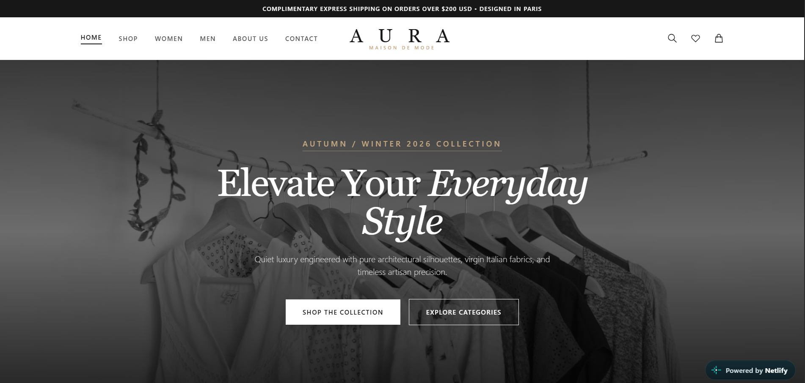
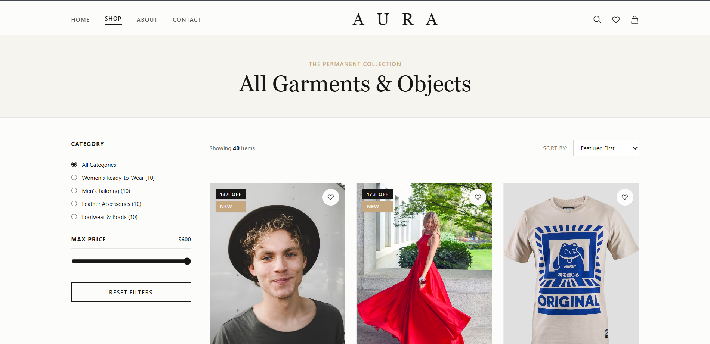
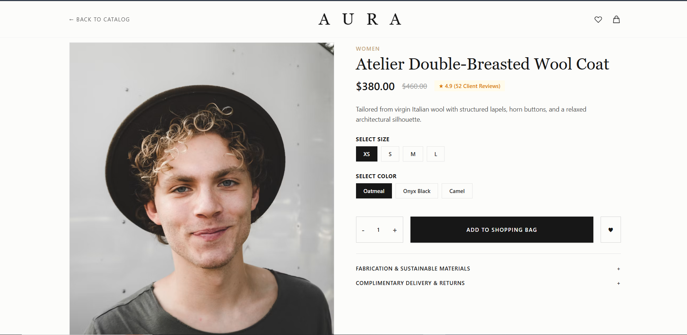
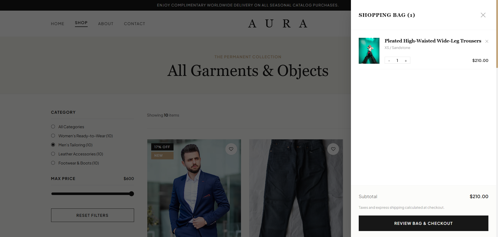

# AURA — Luxury Fashion E-Commerce Website

A modern and responsive luxury fashion e-commerce website designed with a premium minimalist aesthetic.

[🌐 Live Demo](https://ahmed-dev01.github.io/aura-fashion/)

---

## 📌 Overview

AURA is a frontend fashion e-commerce website created to showcase luxury fashion products through an elegant and user-friendly interface.

The project focuses on responsive design, dynamic product rendering, and interactive shopping experiences.

---

## ✨ Features

- Responsive luxury fashion website
- Product catalog and product details
- Dynamic product rendering
- Category filtering
- Price filtering
- Product size and color selection
- Shopping cart functionality
- Wishlist functionality
- Quantity controls
- Promo code interface
- Contact form
- FAQ section
- Responsive user interface

---

## 🛠️ Technologies Used

- HTML5
- CSS3
- JavaScript
- Tailwind CSS (CDN)

---

## 📸 Screenshots

### Homepage



### Shop Page



### Product Details



### Shopping Cart



---

## 📂 Project Structure

```text
aura-fashion/
├── index.html
├── about.html
├── shop.html
├── product-details.html
├── cart.html
├── contact.html
├── wishlist.html
├── css/
│   └── style.css
├── js/
│   ├── apps.js
│   └── products.js
└── screenshots/
    ├── homepage.png
    ├── shop.png
    ├── product-details.png
    └── cart.png
```

---

## 🚀 Getting Started

### 1. Clone the Repository

```bash
git clone https://github.com/Ahmed-dev01/aura-fashion.git
```

### 2. Open the Project

Navigate to the project folder.

### 3. Run the Website

Open `index.html` using VS Code Live Server.

---

## 🎯 Project Purpose

This project was developed to practice frontend web development, responsive design, JavaScript interactions, and e-commerce user interface implementation.

It helped me improve my understanding of website structure, dynamic content, and interactive user experiences.

---

## 🔮 Future Improvements

- Backend integration
- User authentication
- Database integration
- Real payment gateway
- Production-ready order processing
- Admin dashboard
- Order management system

---

## 👨‍💻 Author

**Ahmed Raza**

GitHub: [Ahmed-dev01](https://github.com/Ahmed-dev01)

---

## 📄 License

This project was created for learning and portfolio purposes.
